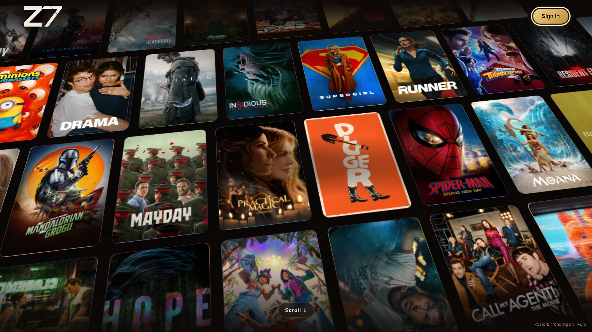
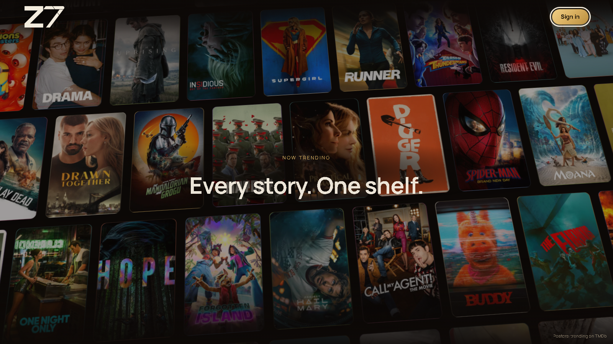
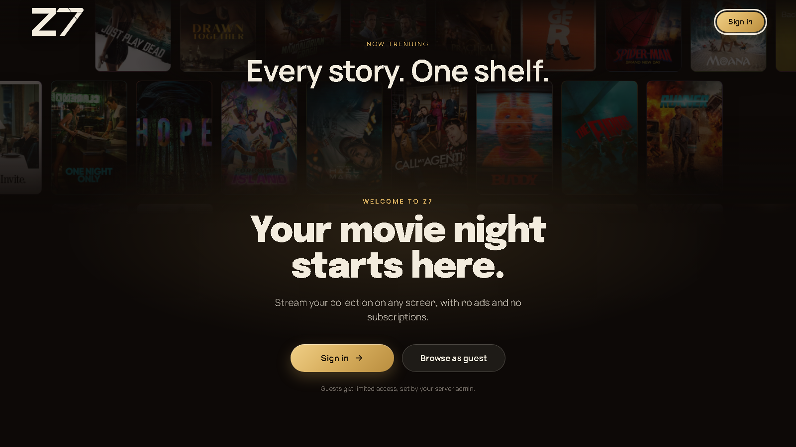
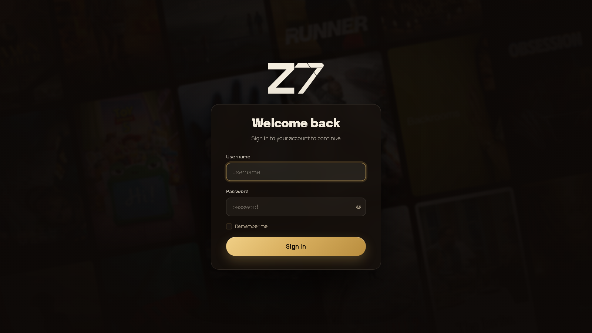
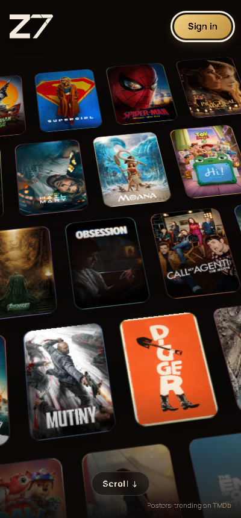
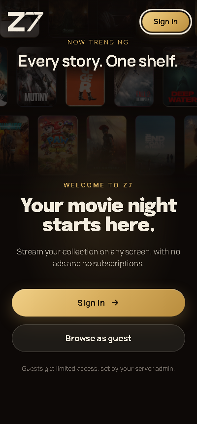

<p align="center">
  <picture>
    <source media="(prefers-color-scheme: dark)" srcset="branding/logo.svg">
    
  </picture>
</p>

<h3 align="center">Your movie night starts here.</h3>

<p align="center">
  A self-hosted streaming server for movies, series and music, with a cinematic, Netflix-style look.
</p>

<p align="center">
  <a href="LICENSE"></a>
  <a href="https://dotnet.microsoft.com/"></a>
</p>



**Z7-MovieStream** is my own streaming server for family and friends. Upload your movies and
series, share one link, and everyone gets a polished streaming experience on the web, phone
or TV, with no ads and no subscriptions.

## Screenshots

| Scroll-driven welcome | Rising call to action |
| --- | --- |
|  |  |

| Sign in | Mobile |
| --- | --- |
|  |   |

## Highlights

- **Scroll-driven welcome page:** a 3D wall of this week's trending posters flattens and rises as
  you scroll, then hands off to a large "Sign in / Browse as guest" call to action. Works in
  every browser, including Firefox, and respects reduced-motion settings.
- **Premium sign-in and setup pages:** frosted-glass card over a blurred poster backdrop, larger
  fields and a gold call-to-action button.
- **Cinematic empty home page:** slowly sliding poster rows with a clear next step, including
  "Add library" for admins.
- **Poster depth in carousels:** posters subtly scale as they slide past.
- **Trending posters API:** `GET /api/trending-posters` returns this week's trending movie
  posters from TMDb, cached for 6 hours.
- **Zero-downtime deploys:** a blue-green deploy script keeps the site up while a new version
  rolls out (not in this repo; see [Deploying](#deploying)).

## Features

- **Movies, TV series and music** in one library, with automatic posters and details from TMDb,
  TheTVDB and MusicBrainz
- **Watch anywhere:** web, Android (phone and TV), Windows, iOS and Mac, with on-the-fly
  transcoding (FFmpeg, HLS) when a device or connection can't play the original file
- **Accounts and access:** local sign-in, optional two-factor and OIDC single sign-on, optional
  guest mode, and per-library and per-profile restrictions
- **Watch together** with Sync Play, remote control between devices, and Chromecast (web and
  Android)
- **Your space:** playlists, dynamic playlists, collections, history, stats, reviews and offline
  downloads on native apps
- **Personalization:** custom home page, playback preferences, global filters, and editable
  metadata with field locks
- **Music extras:** OpenSubsonic support for apps like Symfonium and Feishin, and optional
  AudioMuse AI discovery
- **Administration:** dashboard, diagnostics, background tasks, webhook notifications, and an
  import tool for Plex, Jellyfin and Spotify
- **Federation:** link two servers to share media without duplicating files

## Quick start (Docker)

```bash
git clone https://github.com/Iriajul/Z7-MovieStream.git
cd Z7-MovieStream

docker build -t z7-server:latest .

cp .env.example .env
# In .env, set POSTGRES_PASSWORD and SECURITY__APIKEYS__HASHSECRET to long random values

docker compose up -d
```

Open `http://localhost:7080`. On first run, the server prints a one-time setup token in its logs:

```bash
docker logs z7-server 2>&1 | grep SETUP_TOKEN
```

Paste it on the setup page to create your admin account. Then add a library under
**Administration → Content → Libraries**. The container sees your media through the folders you
mount in `docker-compose.yaml` (for example `/media/movies`).

More detail: [docs/admin/install.md](docs/admin/install.md).

## Folder layout

Consistent names help Z7 find the right posters and details:

```text
movies/
  Movie Name (2019).mkv
series/
  Show Name/
    Season 01/
      Show Name - S01E01 - Pilot.mkv
```

Full naming rules: [docs/admin/operating.md](docs/admin/operating.md#folder-and-naming-conventions).

## Deploying

Z7 can run on any machine with Docker. For a public server, put it behind a reverse proxy with
HTTPS (Caddy works well) and keep the app port bound to localhost.

My own deployment runs on AWS EC2 with Terraform, Ansible, Caddy and a blue-green
zero-downtime deploy script. That setup lives in a separate private repository because it
contains server details.

## Development

- Web app with a local database: `dotnet run --project src/Server/Web`
- Component catalog, no database needed: `dotnet run --project src/Clients/DesignSystem`

Guides for architecture, design and testing: [docs/README.md](docs/README.md).

## Credits

- Poster images and movie data come from [TMDb](https://www.themoviedb.org). This product uses
  the TMDB API but is not endorsed or certified by TMDB.
- Also built with [FFmpeg](https://ffmpeg.org), [LibVLC](https://www.videolan.org/vlc/libvlc.html),
  [OpenIddict](https://github.com/openiddict/openiddict-core),
  [TheTVDB](https://www.thetvdb.com), [MusicBrainz](https://musicbrainz.org),
  [Wikimedia](https://commons.wikimedia.org),
  [Chromaprint / AcoustID](https://acoustid.org/chromaprint),
  [TagLibSharp](https://github.com/mono/taglib-sharp),
  [AudioMuse AI](https://github.com/NeptuneHub/AudioMuse-AI) and
  [Phosphor Icons](https://phosphoricons.com).

## License

Z7 is licensed under the [GNU Affero General Public License v3.0](LICENSE) (AGPL-3.0). If you
modify Z7 and make it available to users over a network, you must share your modified source
code under the same license.
